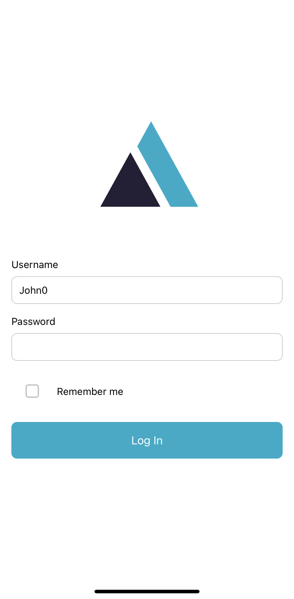
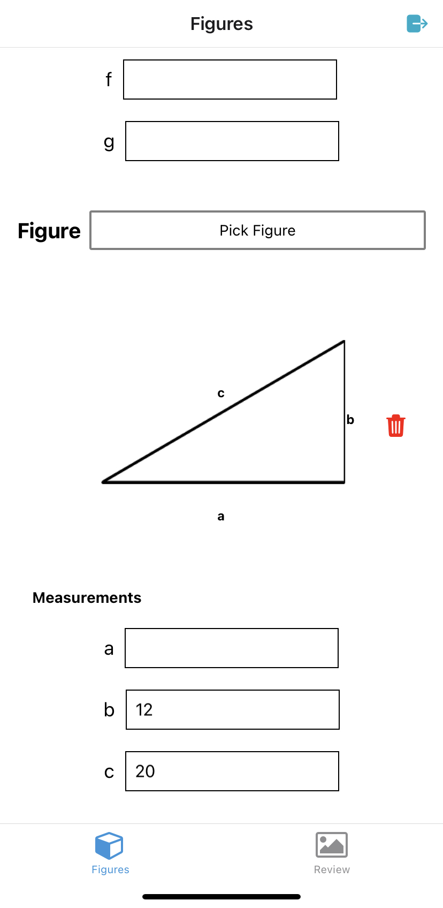
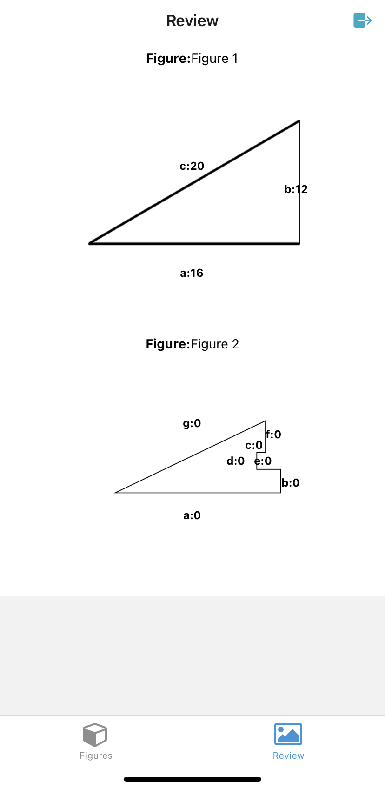

# Notes

### General

The Mobile developer test was completed and evaluated within a very small time frame to achieve the proposed requirements and deliver a working solution since it was requested using another technology.

### Login

The authentication flow assumes there is already a user registered with the following credentials:

- User: John0
- Password: 123

The flow doesn’t contain logout, this feature along with other creative ideas i had could've been implemented as extras with a longer time frame. In a real-world scenario, another service would have been used to authenticate the user(backend, session, local database sync etc).

### Picking figures and design

I assumed the design of the screen was to pick figures. On a daily basis this would have asked/suggest and shared other user-friendly designs with the team focusing on both UI and UX.

### Improvements for next iteration

- Better error and validation handling*
- UX and performance by managing images' coordinates and rendering while keeping the same dimensions
- Remove redundancy, reuse styles, extract logic and delegate to new components
- Improve state management and its relationship with calculations and avoid side effects
- Adding core unit tests

## Regarding validation*

This working solution assumes there could be only one field left empty when entering figures' values.

